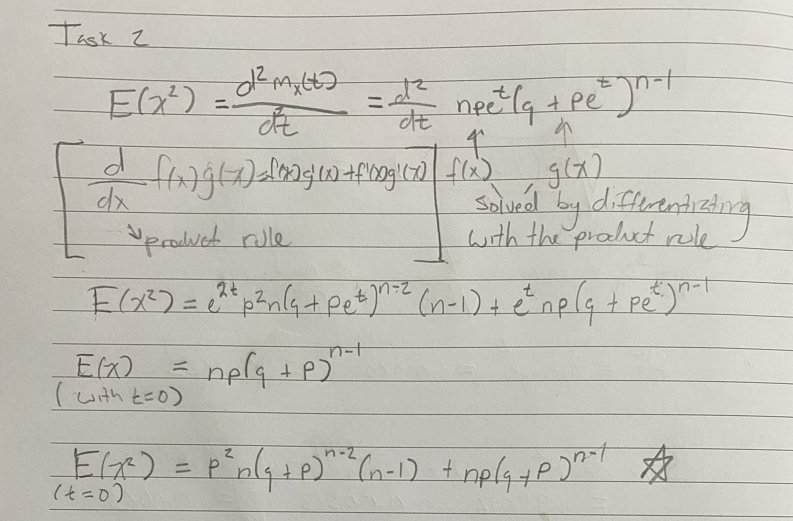

```{r setup, include=FALSE}
knitr::opts_chunk$set(echo = TRUE, message = FALSE)
```

# Introduction

We have learnt that the MGF for a binimial random variable is:

$$M_X(t) = (q+pe^t)^n $$

Where $X\sim Bin(n,p)$

# Tasks

Using the moment generating function above prove that 

$$\sigma^2 = npq$$

by answering the tasks below. 
Use $\LaTeX$ to construct the proof for Task 1.

## Task 1

Start with 

$$
\begin{eqnarray}
E(X) &=& \left . \frac{d M_X(t)}{dt}\right |_{t=0}\\
&=& npe^t(q + pe^t)^{n - 1}\\
\end{eqnarray}
$$


## Task 2

You may use paper and write neatly the proof - take a picture and place in the document using 

`{}`

Now find $E(X^2)$

$$
\begin{eqnarray}
E(X^2) &=& \left . \frac{d^2 M_X(t)}{d^2t}\right |_{t=0}\\
&=& 
\end{eqnarray}
$$


## Task 3

Find 

$\sigma^2$ Using the formula $\sigma^2 =E(X^2)-\mu^2$

